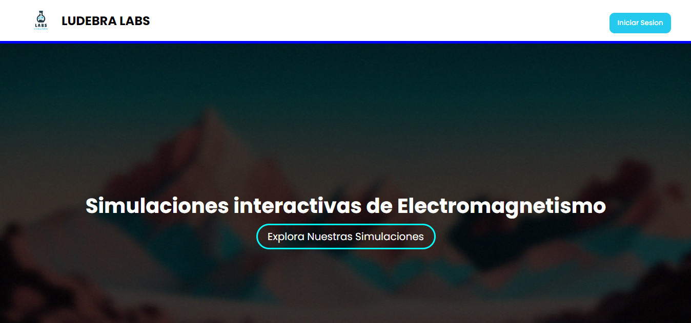
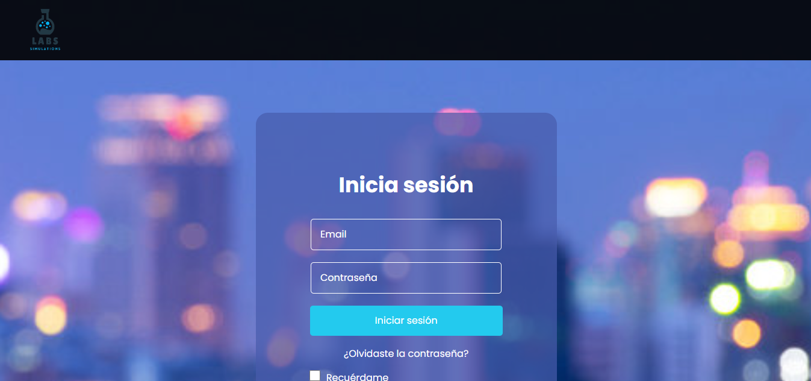
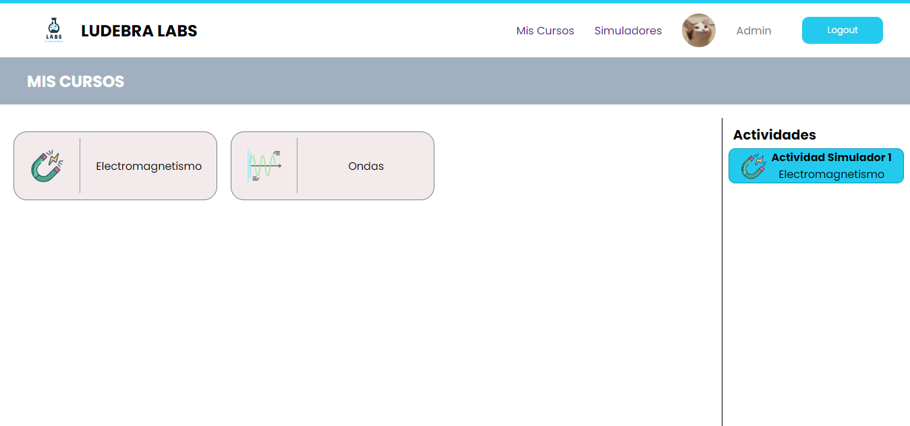
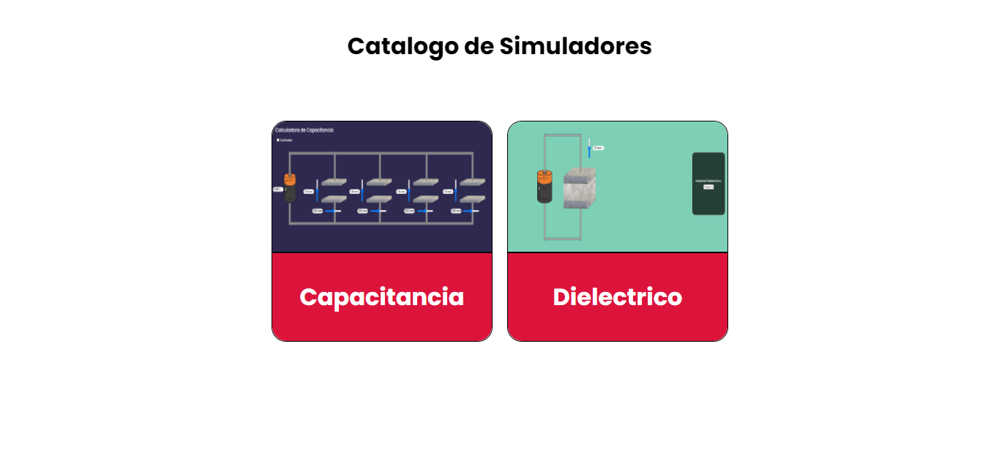
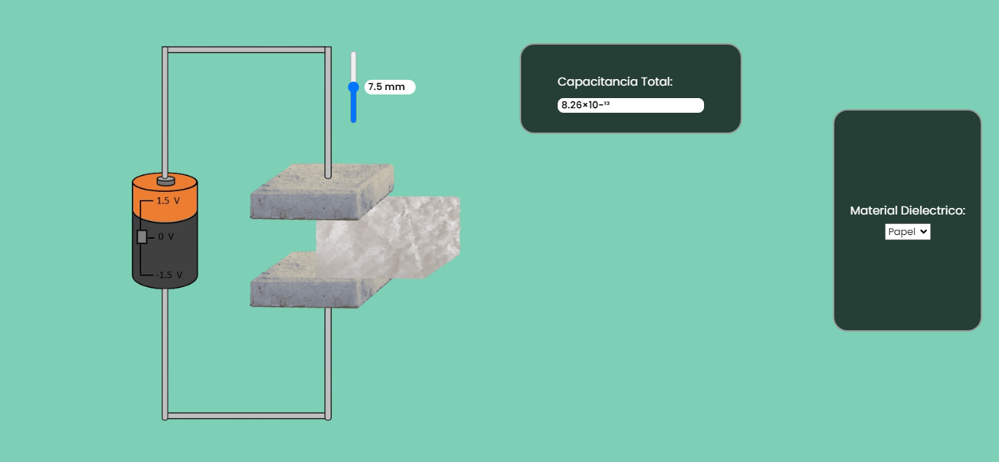
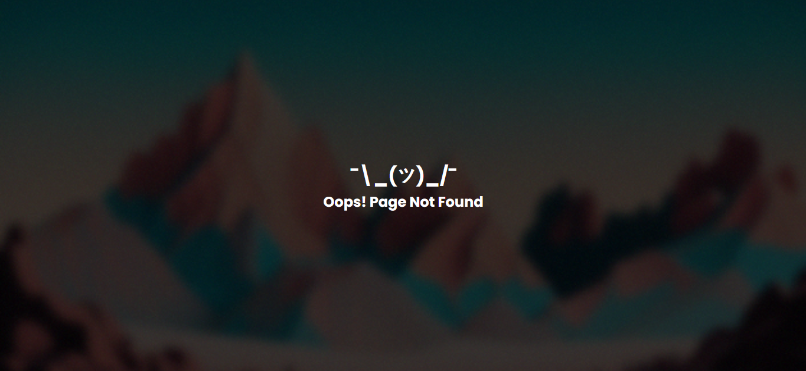

# TRABAJO SEGUNDO PARCIAL
### Por: Deimis Henao

Este es el trabajo complementario del segundo parcial de Programacion Web y un vistazo al desarrollo del proyecto de aula: "Laboratorio Virtual".

## Problemas Comunes
1. Puede presentar el problema de que no se compila el proyecto usando:
   ```
    npm run dev
   ```
    Si presenta algun problema, puede dirigirse a el siguiente link:
    ```
    https://trabajocomplementario.netlify.app
    ```
2. Puede ocurrir el siguiente error en la terminal:
   ```
   "npm run dev" no se reconoce como un comando interno o externo
   ```
   Si presenta este error, puede dirigirse al siguiente link:
   ```
   https://trabajocomplementario.netlify.app
   ```
3. Puede ocurrir el siguiente error en la terminal:
   ```
   Could not fast refresh {"useAuth" export is incompatible}.
   ```
   Si presenta este error, puede que presente un error de rutas, puede solucionarlo de la siguiente manera:
    
    1. Abra la terminal y digite la siguiente linea de comando:
    ```
    npm install react-router-dom
    ```
    2. Si el problema no se soluciona, dirijase al siguiente link:
    ```
    https://trabajocomplementario.netlify.app
    ```

## Vistas Generales
En el proyecto se encuentran unas vistas generales que dan una experiencia agradable al usuario, ademas que permiten que los usuarios puedan usar la aplicacion de la mejor manera posible. 

**Overview**
<p align='center'>
    
</p>

**Login**
<p align='center'>
    
</p>

**Courses**
<p align='center'>
    
</p>

**Simulators**
<p align='center'>
    
</p>

**Dielectric**
<p align='center'>
    
</p>

**Not Found**
<p align='center'>
    
</p>

## Rutas Añadidas
Se dara un pequeño vistazo de la rutas añadidas:

## Usuarios y Autenticacion
Para el ingreso de usuarios (De momento) se tiene:
```
    Usuario: admin
    Contraseña: 12345
```
## Agradecimientos
Si se tiene alguna duda, puede contactarse con el equipo de desarrollo:
* `@kyottah` en Instagram
* `github.com/mibichoandafugao` en Github 

Especial Agradecimiento al Docente **Wilman Vega**
* `github.com/wilvec` en Github